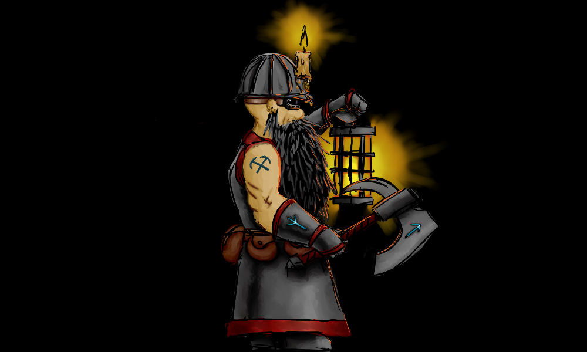
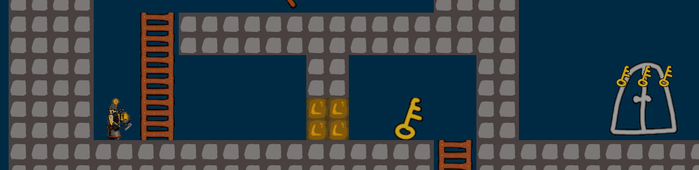

[](https://travis-ci.com/Jazarro/dwarf_seeks_fortune)
[](https://github.com/rust-secure-code/safety-dance/)

# Dwarf Seeks Fortune
A 2D puzzle platformer made with the Amethyst game engine. This game is an homage to the 1988 classic [King's Valley II](https://en.wikipedia.org/wiki/King%27s_Valley_II). 



## Gameplay
You're a dwarf, digging through the ancient ruins of your ancestors. Each level presents a different puzzle. The aim is to collect all keys, after which the door to the next level is unlocked. Puzzle elements include one-time-use tools that must be picked up and used in a specific order at specific locations.



## Design goals:
- This project aims to be a helpful resource for people learning Amethyst. Code should ideally be  thoroughly documented and easy to understand. It should be kept up to date with the latest version of Amethyst and should follow best practices.
- This game should be accompanied by guides explaining how certain features are implemented. These guides should aim to serve as a next step after reading the pong tutorial and the basic examples.
- This game should ideally depend on a specific release version of the Amethyst engine. This will make for a more stable example. 
- I personally hate games that make you use the mouse more than necessary. This game must be fully accessible with a keyboard alone. Mouse input should always be optional.

## Quickstart

- Clone the repository

```bash
git clone https://github.com/Jazarro/dwarf_seeks_fortune.git
cd dwarf_seeks_fortune
```

- Build and run the project

```bash
cargo run
```

#### For Mac Users

Open the `/dwarf_seeks_fortune/Cargo.toml` file and change `vulkan` to `metal`. You have now changed the renderer backend to one that works on MacOS. This step will hopefully [become unnecessary](https://community.amethyst.rs/t/we-need-to-figure-out-a-way-to-adapt-the-features-of-the-amethyst-dependency-to-the-platform-the-game-is-being-compiled-on/1596?u=jazarro) in the future. 

#### For Linux Users

You might need to install some dependencies. Please refer to [this section](https://github.com/amethyst/amethyst#dependencies) of the Amethyst README for more details.

## Features:
- [x] In-game level editor. Allows for rapid iteration when designing levels.
- [x] Time rewinding mechanic to help fix mistakes when solving the puzzles. Might be removed if it proves superfluous or reductive to the experience. For now, it serves as a handy debugging tool.
- [x] Derpy movement mechanics akin to those of the game this is based on. This game purposely refrains from using a full physics simulation, opting instead for predictable grid-based movements suitable for a puzzle game.
- [x] Multiple playable levels.
- [x] Sound effects and music.

## Art
At the moment, everything is temporary, placeholder, programmer art. There will be some real art assets soon.