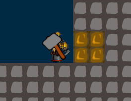
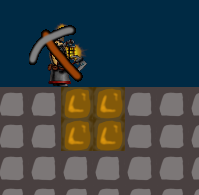

# Level Design Guide
This is a guide to designing levels for Dwarf Seeks Fortune. As the level editor is constantly improving and game elements are added over time, this document will be updated accordingly.

## How does the game work?
Each level is a puzzle. The player must collect all keys, then reach the exit door. In order to reach these objectives, the player must interact with puzzle elements such as one-time-use tools, often in a specific order.

All levels wrap at the borders. That is, if the player exits the level at the right edge, they emerge at the left edge. Similarly, if they jump into a pit, they will emerge at the top of the level.

All levels must at least include these elements: 

- Exactly one player
- Exactly one exit door
- One or more keys

## Elements

### Tools
The player often needs tools to gain access to keys and the door. An example of a tool is a hammer, which allows the player to break through a wall. Tools have some restrictions:
- If the player intersects with a tool, they equip that tool automatically. 
- The player can equip at most one tool at a time. If they have a tool equipped, they will not pick up any other tools.
- The player cannot drop tools.
- Tools are single-use; once used, they are destroyed.
- Using a tool and jumping are bound to the same key: if the player has a tool equipped, they cannot jump. This restricts what areas the player can access whilst carrying a tool.

Currently, there is support for two different kinds of tools. The exact shape of these tools is subject to change, but the mechanics are not.
- A pickaxe, which allows the player to break two by two blocks below them.
- A hammer, which allows the player to break two by two blocks in front of them.

Here are some screenshots, showing how the tools work. The player is facing right, the gold-coloured blocks are the ones that the tool would break.

## A note on jumping
This game is specifically NOT about hand-eye coordination or pixel-perfect jumps. To that end, jumps are either easy, or impossible.

If you want a player to be able to jump across a gap, make it 2-wide. To prevent a player from jumping across, make it at least 5-wide. Jumping mechanics will be redone in the future, a 4-wide gap should suffice then.